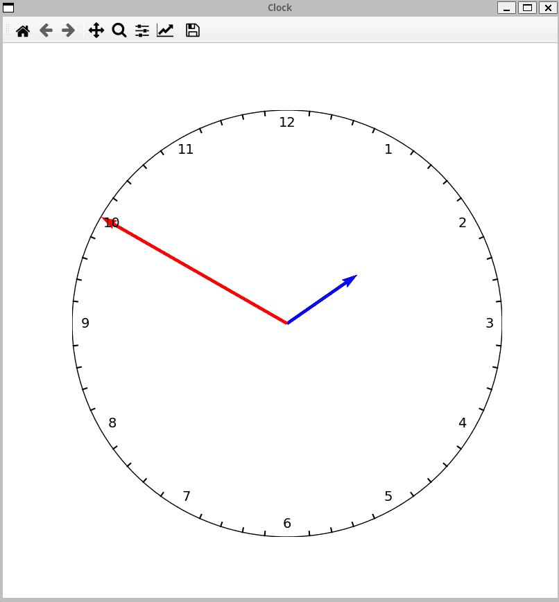

# Clock

This project is dedicated for learning basic `numpy` and `matplotlib`. It uses simple linear algebra to calculate rotations of clock arrows.

Run with
```bash
poetry run python3 clock.py
```



Clock does not work by itself, but it can be adjusted with left/right arrow keys :)
